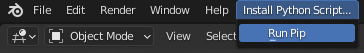
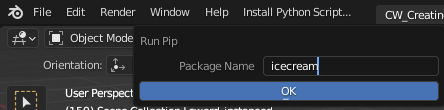

## Pip for Blender

Very basic addon that adds a top menu link to install python packages through pip.

    

Currently just the latest version of the package is installed, with no additional options available.

### Instructions

Download the zip and install the use_pip.py file to install the addon. If applicable (when you changed the blender install location) set the proper location. The addon uses this path to find out where to install the pip packages so Blender can find them.

### Usage

A top menu is added where pip can be called from. Simply put in the package name and it should be installed in the correct directory.

    

#### Status

I am currently not planning on developing this any further as it does what I want it to do, but feel free to ask questions and let me know when something is not working!